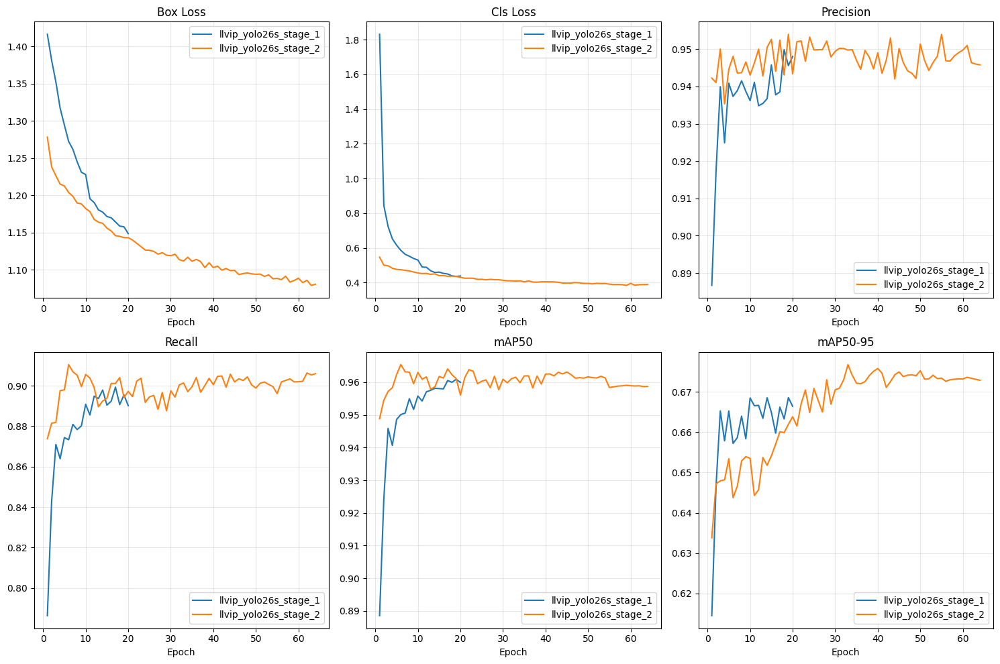
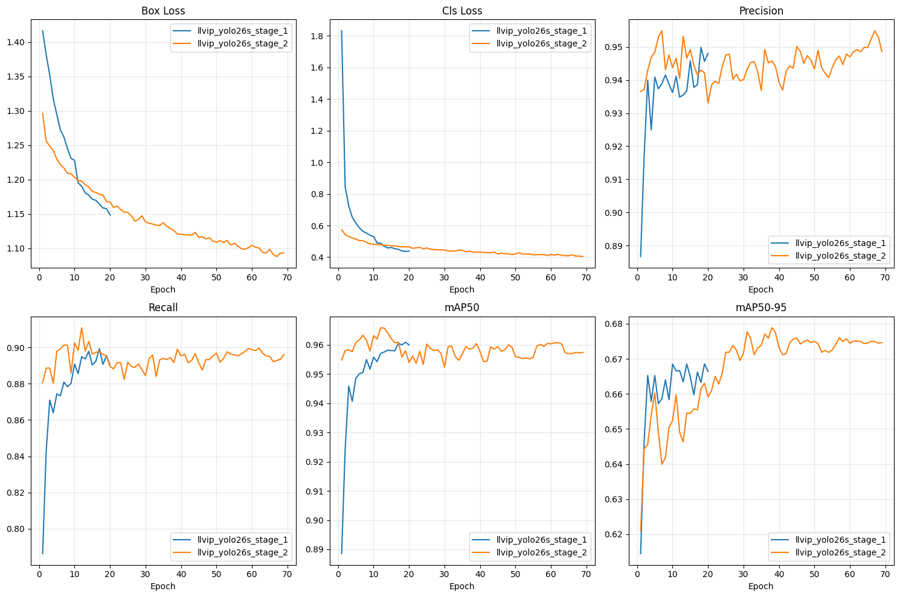
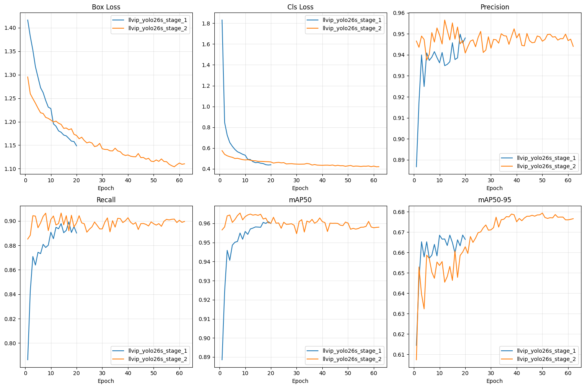
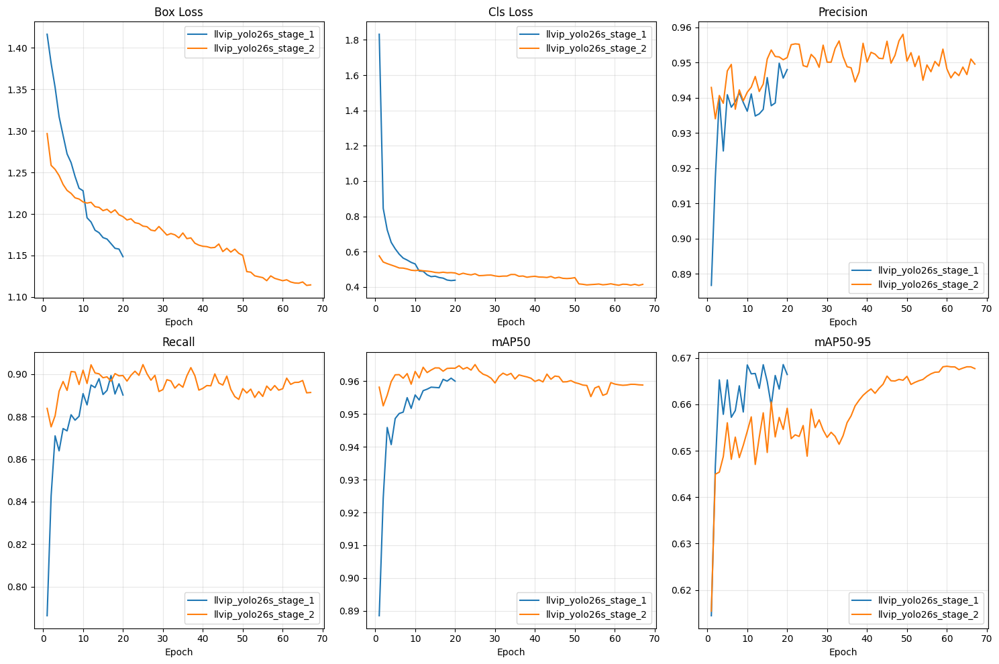
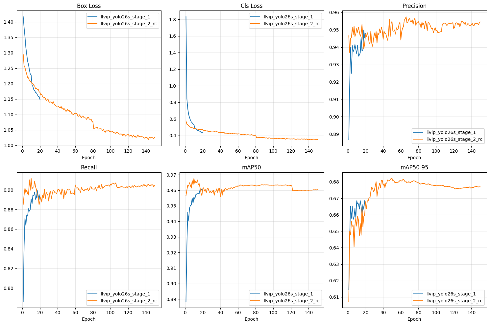

# TW

To run,

```sh
uv sync
```

## Stage 1

- [x] Download the dataset
- [x] Convert to YOLO format
- [x] Wait for a couple of days

### Stage 1.2 training tracking

#### Run 1

```py
model.train(
    data=yaml_path,
    epochs=70,
    imgsz=960,
    batch=16,
    optimizer="MuSGD",
    lr0=1e-4,
    momentum=0.948,
    name="llvip_yolo26s_stage_2",
    patience=20,
    cache='disk',
    trainer=CustomSaveTrainer,
    exist_ok=True,
    # Augmentation
    hsv_h=0.0,
    hsv_s=0.0,
    hsv_v=0.4,
    degrees=5.0,
    translate=0.2,
    scale=0.4,
    flipud=0.0,
    fliplr=0.5,
    mosaic=0.0,
    mixup=0.0,
    erasing=0.0,
)
```



#### Run 2

```py
model.train(
    data=yaml_path,
    epochs=100,
    imgsz=960,
    batch=16,
    optimizer="MuSGD",
    lr0=1e-4,
    lrf=0.1,
    momentum=0.948,
    warmup_epochs=5,
    name="llvip_yolo26s_stage_2",
    patience=30,
    cache='disk',
    trainer=CustomSaveTrainer,
    exist_ok=True,
    close_mosaic=20,
    # Augmentation
    hsv_h=0.0,
    hsv_s=0.0,
    hsv_v=0.2,
    degrees=5.0,
    translate=0.2,
    scale=0.4,
    flipud=0.0,
    fliplr=0.5,
    mosaic=0.2,
    mixup=0.0,
    erasing=0.2,
)
```



#### Run 3 (ongoing)

```py
model.train(
    data=yaml_path,
    epochs=100,
    imgsz=960,
    batch=16,
    optimizer="MuSGD",
    lr0=1e-4,
    lrf=0.02,
    momentum=0.937,
    warmup_epochs=5,
    name="llvip_yolo26s_stage_2",
    patience=30,
    cache='disk',
    trainer=CustomSaveTrainer,
    exist_ok=True,
    close_mosaic=50,
    # Augmentation
    hsv_h=0.0,
    hsv_s=0.0,
    hsv_v=0.2,
    degrees=5.0,
    translate=0.2,
    scale=0.4,
    flipud=0.0,
    fliplr=0.5,
    mosaic=0.2,
    mixup=0.0,
    erasing=0.2,
)
```



#### Run 4

```py
model.train(
    data=yaml_path,
    epochs=100,
    imgsz=960,
    batch=16,
    optimizer="MuSGD",
    lr0=5e-5,
    lrf=0.02,
    momentum=0.937,
    warmup_epochs=5,
    name="llvip_yolo26s_stage_2",
    patience=30,
    cache='disk',
    trainer=CustomSaveTrainer,
    exist_ok=True,
    close_mosaic=50,
    # Augmentation
    hsv_h=0.0,
    hsv_s=0.0,
    hsv_v=0.2,
    degrees=5.0,
    translate=0.2,
    scale=0.4,
    flipud=0.0,
    fliplr=0.5,
    mosaic=0.2,
    mixup=0.0,
    erasing=0.2,
)
```



#### Run to move on

```py
model.train(
    data=yaml_path,
    epochs=150,
    imgsz=960,
    batch=16,
    optimizer="MuSGD",
    lr0=1e-4,
    lrf=0.02,
    momentum=0.937,
    warmup_epochs=5,
    name="llvip_yolo26s_stage_2_rc",
    patience=50,
    cache='disk',
    trainer=CustomSaveTrainer,
    exist_ok=True,
    close_mosaic=70,
    # Augmentation
    hsv_h=0.0,
    hsv_s=0.0,
    hsv_v=0.2,
    degrees=5.0,
    translate=0.2,
    scale=0.4,
    flipud=0.0,
    fliplr=0.5,
    mosaic=0.2,
    mixup=0.0,
    erasing=0.2,
)
```



## Stage 2

- [ ] Obtain FLIR thermal dataset
- [ ] Convert to YOLO format
- [ ] Eval the model

## Stage 3

- [ ] Build LLM system prompt
- [ ] Eval on small subset
- [ ] Batch run on Jetson
