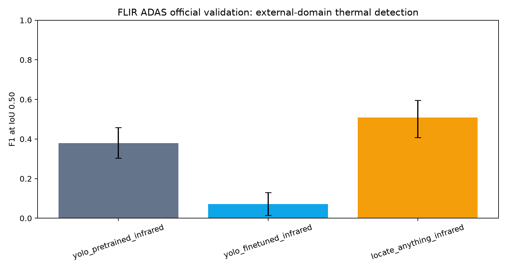
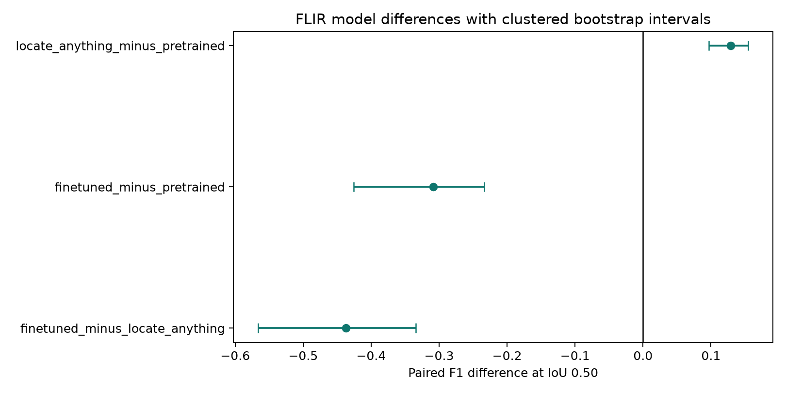

# YOLO26n vs. LocateAnything-3B for Visible and Thermal Person Detection

## Abstract

This evaluation asks whether a general-purpose vision-language grounding model
can outperform a compact detector on domain-shifted person detection, and what
accuracy is purchased by task-specific thermal fine-tuning. Three frozen model
states were compared: pretrained YOLO26n, a clean LLVIP-thermal-fine-tuned
YOLO26n, and LocateAnything-3B. The locked LLVIP test contains 3,463 paired
visible/infrared image IDs; the external FLIR ADAS evaluation contains 1,144
official-validation 8-bit AGC thermal images.

On LLVIP visible images, LocateAnything achieved F1 0.861 at IoU 0.50 versus
0.770 for pretrained YOLO, a paired difference of 0.091
[0.083, 0.099]. On LLVIP thermal images, fine-tuned YOLO led with F1 0.934
versus 0.892 for LocateAnything, a paired difference of 0.042
[0.035, 0.048]. That specialization did not transfer to FLIR: fine-tuned YOLO
fell to F1 0.071, compared with 0.379 for pretrained YOLO and 0.508 for
LocateAnything. The cross-dataset change in YOLO fine-tuning uplift was -0.554
[-0.689, -0.455].

The generalist therefore supplied the strongest modality-agnostic behavior, but
not the best in-domain thermal accuracy. Its advantage also came with much
higher measured batch-1 latency, memory, and GPU cost, plus structured-output
failures. Conclusions are limited to these datasets, model versions, prompts,
operating points, and single training/inference seeds.

## Research questions and answers

1. **Can a general-purpose grounding model beat a compact detector without
   task-specific fine-tuning?** Yes on both evaluated visible-image LLVIP and
   external thermal FLIR comparisons, but not against the LLVIP-thermal-tuned
   detector on its source domain.
2. **What does thermal supervision buy?** A large LLVIP thermal gain:
   fine-tuned minus pretrained YOLO was 0.246
   [0.235, 0.256] F1 at IoU 0.50.
3. **Does that gain generalize across thermal datasets?** No. The same
   checkpoint lost 0.308 [0.234, 0.426] F1 relative to pretrained YOLO on FLIR.
4. **What is the systems tradeoff?** YOLO required about 5.6–5.9 ms per LLVIP
   image and roughly 0.06–0.07 GiB peak allocated GPU memory. LocateAnything
   required 1.54–1.69 s and 13.92 GiB under the same warm batch-1 LLVIP
   measurement protocol.

## Experimental design

### Datasets and leakage controls

[LLVIP](https://arxiv.org/abs/2108.10831) provides aligned visible/infrared
low-light pairs with pedestrian annotations. Its 12,025 official training pairs
were split by capture-sequence prefix into 9,620 training and 2,405 validation
pairs. All 3,463 official test pairs were excluded from training, checkpoint
selection, prompt selection, and operating-point selection.

The [expanded FLIR ADAS dataset](https://oem.flir.com/en-150/about/news/expanded-teledyne-flir-starter-thermal-dataset-for-adas-and-autonomous-vehicle-testing/)
was used only as a frozen-model external-domain benchmark. Evaluation retained
all 1,144 official-validation 8-bit AGC thermal images, including 325 images
without a `person` annotation, and the exact COCO `person` category. Other
classes were ignored. COCO crowd-overlap handling was implemented, although the
selected manifest contains zero ignored-person boxes. The 1,144 images form 17
video groups used for clustered uncertainty estimates.

FLIR is not treated as a camera-only intervention: geography, road scenes,
annotation policy, object scale, and acquisition processing all change. It is
also not called guaranteed zero-shot evaluation because the pretraining
contents of the two base models cannot exclude FLIR-like data.

### Models and fixed inference protocols

| State | LLVIP visible | LLVIP infrared | FLIR infrared |
| --- | :---: | :---: | :---: |
| Pretrained YOLO26n | yes | yes | yes |
| LLVIP-thermal-fine-tuned YOLO26n | yes | yes | yes |
| LocateAnything-3B | yes | yes | yes |

YOLO used Ultralytics 8.4.102, image size 640, batch size 1 for primary latency,
the one-to-one end-to-end head, maximum 300 detections, and confidence 0.25.
Separate confidence-0.001, batch-64 sweeps supplied secondary AP estimates;
those detections were not substituted into the primary comparison.

LocateAnything used `nvidia/LocateAnything-3B` revision
`c32291ca5e996f5a7a485845b4f57a233936bba0`, BF16, RGB input, the official
person prompt, hybrid generation, `max_new_tokens=8192`, temperature 0.7, and
sampling enabled. Each image received a reproducible seed derived from base
seed 20260721. Generated normalized boxes were validated without silently
repairing reversed, degenerate, or out-of-range coordinates.

These are **fixed-output metrics at locked operating points**, not
threshold-free model comparisons. LocateAnything does not expose detector
confidences comparable to YOLO, which is why AP is secondary and YOLO-only.

### Matching, metrics, and uncertainty

Predictions were matched one-to-one to same-class ground truth using
maximum-cardinality matching at IoU 0.50 and 0.75, with higher total IoU breaking
equal-cardinality assignments. Reported measures are precision, recall, F1,
mean matched IoU, FP/FN per image, duplicate rate, and malformed/no-output/error
rates. Object-size recall uses COCO native-pixel area thresholds.

LLVIP intervals are 95% paired image-level percentile bootstrap intervals;
FLIR intervals resample video groups so frames from one sequence remain
clustered. Both use 2,000 replicates and seed 20260721. Paired differences use
identical resamples within each dataset. Intervals quantify sampling
uncertainty under these procedures, not model, training, prompt, or dataset
uncertainty.

## Clean YOLO26n thermal training

The clean single-seed run completed 50 epochs on one NVIDIA A10. Checkpoint
selection and early stopping saw only the 2,405-image validation split; the
official LLVIP test set was absent from the runtime dataset YAML. The selected
epoch was 44.

| Validation metric | Value |
| --- | ---: |
| Precision | 0.9321 |
| Recall | 0.9167 |
| mAP50 | 0.9503 |
| mAP50-95 | 0.5879 |

| Provenance field | Value |
| --- | --- |
| Run ID | `yolo26n-thermal-e50-seed20260721` |
| Seed | `20260721` |
| Ultralytics / PyTorch | `8.4.102` / `2.13.0+cu130` |
| GPU / image size / batch | NVIDIA A10 / 640 / 64 |
| Initial checkpoint SHA256 | `9b09cc8bf347f0fc8a5f7657480587f25db09b34bf33b0652110fb03a8ad4fef` |
| Best checkpoint SHA256 | `66ba7bf3c07ea894e96767cc184d2f060d1baa0f8aaa3f6912a9600ddbdf0eed` |
| Last checkpoint SHA256 | `8642c2cc271805bca13d0892bc33e1d62c9680a1784f65cffda7e9bb67943aee` |
| Split manifest SHA256 | `05facc1b82630ec515cfdb0df16617f1c6390fc5af009b4c090a8343e78b33ef` |
| Train/validation archive SHA256 | `2916455d4e9afa6c0c5d74db3785a6a2f8adc9b304ea797fc3699095fe6a3c44` |
| Training app SHA256 | `5b5f6ad439bf7139540c95b09c5b886f4305a84d509c891359a6eb610cd71bed` |

Training took 2,859.2 seconds, reached 8.90 GiB peak allocated memory, and was
estimated at $1.33 using the July 22, 2026 Modal rates. The estimate excludes
container startup and pre-training archive verification. The run initialized
from official `yolo26n.pt` and used MuSGD, `lr0=0.0054`, `lrf=0.0495`,
momentum 0.947, weight decay 0.00064, 0.98 warmup epochs, patience 20, and the
recorded low-mosaic thermal augmentations.

## LLVIP locked full-test evaluation

All six canonical files contain exactly the same 3,463 official test IDs.

### Fixed-output accuracy

| Run | P@.50 [95% CI] | R@.50 [95% CI] | F1@.50 [95% CI] | Matched IoU | FP/image | FN/image |
| --- | ---: | ---: | ---: | ---: | ---: | ---: |
| Pretrained YOLO, visible | 0.873 [0.864, 0.882] | 0.689 [0.677, 0.700] | 0.770 [0.761, 0.779] | 0.786 | 0.240 | 0.746 |
| Pretrained YOLO, infrared | 0.885 [0.876, 0.893] | 0.563 [0.549, 0.577] | 0.688 [0.677, 0.699] | 0.837 | 0.176 | 1.047 |
| Fine-tuned YOLO, visible | 0.166 [0.151, 0.183] | 0.046 [0.042, 0.051] | 0.072 [0.065, 0.080] | 0.648 | 0.556 | 2.287 |
| Fine-tuned YOLO, infrared | 0.946 [0.941, 0.951] | 0.922 [0.916, 0.928] | **0.934 [0.929, 0.938]** | 0.828 | 0.127 | 0.186 |
| LocateAnything, visible | 0.903 [0.895, 0.910] | 0.823 [0.814, 0.832] | **0.861 [0.854, 0.868]** | 0.795 | 0.213 | 0.424 |
| LocateAnything, infrared | 0.931 [0.925, 0.938] | 0.856 [0.847, 0.865] | 0.892 [0.886, 0.899] | 0.848 | 0.151 | 0.344 |

| Run | P@.75 [95% CI] | R@.75 [95% CI] | F1@.75 [95% CI] |
| --- | ---: | ---: | ---: |
| Pretrained YOLO, visible | 0.583 [0.569, 0.596] | 0.460 [0.448, 0.472] | 0.514 [0.502, 0.526] |
| Pretrained YOLO, infrared | 0.711 [0.698, 0.723] | 0.452 [0.440, 0.465] | 0.553 [0.541, 0.565] |
| Fine-tuned YOLO, visible | 0.031 [0.023, 0.038] | 0.009 [0.006, 0.011] | 0.013 [0.010, 0.017] |
| Fine-tuned YOLO, infrared | 0.761 [0.751, 0.771] | 0.742 [0.731, 0.752] | **0.751 [0.741, 0.761]** |
| LocateAnything, visible | 0.627 [0.614, 0.640] | 0.572 [0.559, 0.585] | **0.598 [0.586, 0.611]** |
| LocateAnything, infrared | 0.767 [0.756, 0.778] | 0.705 [0.694, 0.717] | 0.735 [0.724, 0.746] |

At IoU 0.50, LocateAnything exceeded pretrained YOLO on visible images mainly
through recall (+0.134), while LLVIP-thermal supervision produced the highest
thermal precision and recall. The fine-tuned model's visible collapse confirms
strong specialization rather than a generally improved pedestrian detector.

### Paired effects

| Left minus right | F1@.50 [95% CI] | F1@.75 [95% CI] |
| --- | ---: | ---: |
| Visible pretrained YOLO − LocateAnything | -0.091 [-0.099, -0.083] | -0.084 [-0.094, -0.074] |
| Infrared fine-tuned YOLO − LocateAnything | 0.042 [0.035, 0.048] | 0.016 [0.006, 0.027] |
| Pretrained visible − infrared | 0.082 [0.071, 0.092] | -0.039 [-0.052, -0.025] |
| Infrared fine-tuned − pretrained | 0.246 [0.235, 0.256] | 0.198 [0.186, 0.211] |
| Fine-tuned infrared − visible | 0.862 [0.853, 0.870] | 0.738 [0.727, 0.748] |

### Secondary YOLO AP

| Run | AP50 | AP75 | mAP50-95 |
| --- | ---: | ---: | ---: |
| Pretrained YOLO, visible | 0.768 | 0.398 | 0.411 |
| Pretrained YOLO, infrared | 0.720 | 0.493 | 0.455 |
| Fine-tuned YOLO, visible | 0.019 | 0.005 | 0.006 |
| Fine-tuned YOLO, infrared | 0.944 | 0.707 | 0.620 |

### Output behavior and efficiency

| Run | Statuses | Duplicate rate | Median ms | p95 ms | Peak GiB | GPU cost/1,000 |
| --- | --- | ---: | ---: | ---: | ---: | ---: |
| Pretrained YOLO, visible | ok=3463 | 0.0133 | 5.9 | 6.6 | 0.06 | $0.003 |
| Pretrained YOLO, infrared | ok=3463 | 0.0108 | 5.9 | 6.7 | 0.06 | $0.003 |
| Fine-tuned YOLO, visible | ok=3463 | 0.0009 | 5.7 | 6.4 | 0.07 | $0.003 |
| Fine-tuned YOLO, infrared | ok=3463 | 0.0054 | 5.6 | 6.6 | 0.07 | $0.003 |
| LocateAnything, visible | malformed=8, no_output=32, ok=3423 | 0.0001 | 1541.5 | 1811.2 | 13.92 | $0.868 |
| LocateAnything, infrared | malformed=12, no_output=37, ok=3414 | 0.0000 | 1691.1 | 1822.7 | 13.92 | $0.910 |

LocateAnything was about 263× slower than pretrained YOLO on visible images and
287× slower on infrared by median model time. These are warm batch-1
measurements, not optimized throughput benchmarks. Cost uses only the measured
GPU interval at $0.000542/L40S-second; it excludes cold start, downloads, CPU,
memory, storage, and batching improvements.

### Dataset strata

Brightness quintiles use visible-image intensity for both paired modalities.

| Run | Darkest Q0 | Q1 | Q2 | Q3 | Brightest Q4 |
| --- | ---: | ---: | ---: | ---: | ---: |
| Pretrained YOLO, visible | 0.714 | 0.728 | 0.776 | 0.784 | 0.823 |
| Pretrained YOLO, infrared | 0.525 | 0.644 | 0.673 | 0.767 | 0.758 |
| Fine-tuned YOLO, visible | 0.076 | 0.040 | 0.054 | 0.122 | 0.064 |
| Fine-tuned YOLO, infrared | 0.916 | 0.925 | 0.921 | 0.958 | 0.942 |
| LocateAnything, visible | 0.834 | 0.851 | 0.854 | 0.876 | 0.880 |
| LocateAnything, infrared | 0.852 | 0.906 | 0.871 | 0.917 | 0.907 |

| Run | 1 person | 2 people | 3–4 | 5–8 | 9+ |
| --- | ---: | ---: | ---: | ---: | ---: |
| Pretrained YOLO, visible | 0.749 | 0.777 | 0.779 | 0.765 | 0.713 |
| Pretrained YOLO, infrared | 0.599 | 0.652 | 0.695 | 0.761 | 0.718 |
| Fine-tuned YOLO, visible | 0.045 | 0.070 | 0.069 | 0.102 | 0.093 |
| Fine-tuned YOLO, infrared | 0.947 | 0.932 | 0.935 | 0.928 | 0.907 |
| LocateAnything, visible | 0.882 | 0.864 | 0.864 | 0.840 | 0.837 |
| LocateAnything, infrared | 0.912 | 0.890 | 0.890 | 0.896 | 0.730 |

LLVIP contains no COCO-small ground-truth boxes under native-pixel thresholds.

| Run | Medium recall | Large recall |
| --- | ---: | ---: |
| Pretrained YOLO, visible | 0.366 | 0.706 |
| Pretrained YOLO, infrared | 0.239 | 0.581 |
| Fine-tuned YOLO, visible | 0.071 | 0.045 |
| Fine-tuned YOLO, infrared | 0.735 | 0.932 |
| LocateAnything, visible | 0.388 | 0.846 |
| LocateAnything, infrared | 0.437 | 0.879 |

## FLIR frozen-model external-domain evaluation

### Fixed-output accuracy

| Run | P@.50 [95% CI] | R@.50 [95% CI] | F1@.50 [95% CI] | Matched IoU | FP/image | FN/image |
| --- | ---: | ---: | ---: | ---: | ---: | ---: |
| Pretrained YOLO | 0.821 [0.784, 0.851] | 0.247 [0.186, 0.317] | 0.379 [0.303, 0.458] | 0.800 | 0.211 | 2.944 |
| Fine-tuned YOLO | 0.622 [0.237, 0.750] | 0.038 [0.007, 0.073] | 0.071 [0.014, 0.130] | 0.795 | 0.089 | 3.760 |
| LocateAnything | 0.766 [0.704, 0.798] | 0.380 [0.279, 0.496] | **0.508 [0.407, 0.595]** | 0.789 | 0.455 | 2.422 |

| Run | P@.75 [95% CI] | R@.75 [95% CI] | F1@.75 [95% CI] |
| --- | ---: | ---: | ---: |
| Pretrained YOLO | 0.583 [0.534, 0.644] | 0.175 [0.126, 0.239] | 0.269 [0.204, 0.348] |
| Fine-tuned YOLO | 0.430 [0.125, 0.527] | 0.026 [0.004, 0.052] | 0.049 [0.007, 0.094] |
| LocateAnything | 0.502 [0.459, 0.546] | 0.249 [0.176, 0.339] | **0.333 [0.258, 0.410]** |

LocateAnything led pretrained YOLO by 0.129 [0.097, 0.155] F1 at IoU 0.50
and by 0.064 [0.047, 0.078] at IoU 0.75. Fine-tuned YOLO trailed pretrained
YOLO by 0.308 [0.234, 0.426] and LocateAnything by 0.437
[0.334, 0.566] at IoU 0.50.

### Secondary AP, output behavior, and efficiency

| Run | AP50 | AP75 | mAP50-95 |
| --- | ---: | ---: | ---: |
| Pretrained YOLO | 0.401 | 0.202 | 0.212 |
| Fine-tuned YOLO | 0.049 | 0.027 | 0.029 |

| Run | Statuses | Malformed | No output | Median ms | p95 ms | Peak GiB | GPU cost/1,000 |
| --- | --- | ---: | ---: | ---: | ---: | ---: | ---: |
| Pretrained YOLO | ok=1144 | 0.000 | 0.000 | 5.9 | 7.0 | 0.06 | $0.003 |
| Fine-tuned YOLO | ok=1144 | 0.000 | 0.000 | 5.8 | 6.7 | 0.07 | $0.003 |
| LocateAnything | malformed=13, no_output=383, ok=748 | 0.011 | 0.335 | 235.8 | 603.4 | 7.80 | $0.160 |

LocateAnything's FLIR F1 lead coexisted with a 33.5% no-output rate: when it did
emit valid boxes, it recovered enough people to overcome those whole-image
failures. The latency difference from LLVIP is descriptive of the evaluated
image/workload path and is not evidence of a model implementation change.

### Dataset strata

| Intensity | Pretrained YOLO | Fine-tuned YOLO | LocateAnything |
| --- | ---: | ---: | ---: |
| Q0 | 0.296 | 0.037 | 0.405 |
| Q1 | 0.350 | 0.087 | 0.486 |
| Q2 | 0.406 | 0.116 | 0.539 |
| Q3 | 0.508 | 0.042 | 0.631 |
| Q4 | 0.428 | 0.097 | 0.570 |

| People | Pretrained YOLO | Fine-tuned YOLO | LocateAnything |
| --- | ---: | ---: | ---: |
| 0 | 0.000 | 0.000 | 0.000 |
| 1 | 0.517 | 0.115 | 0.656 |
| 2 | 0.519 | 0.120 | 0.635 |
| 3–4 | 0.479 | 0.133 | 0.582 |
| 5–8 | 0.376 | 0.099 | 0.527 |
| 9+ | 0.320 | 0.023 | 0.451 |

| Time | Pretrained YOLO | Fine-tuned YOLO | LocateAnything |
| --- | ---: | ---: | ---: |
| Day | 0.467 | 0.011 | 0.641 |
| Night | 0.416 | 0.144 | 0.528 |
| Unknown | 0.353 | 0.071 | 0.472 |

| Run | Small recall | Medium recall | Large recall |
| --- | ---: | ---: | ---: |
| Pretrained YOLO | 0.142 | 0.690 | 0.853 |
| Fine-tuned YOLO | 0.004 | 0.206 | 0.049 |
| LocateAnything | 0.271 | 0.857 | 0.912 |

The most consequential FLIR failure is small-person recall. LocateAnything
roughly doubled pretrained YOLO's recall in that stratum, while the
LLVIP-tuned checkpoint detected almost none.

## Qualitative error analysis

The fixed selector chooses non-overlapping extremes for YOLO advantage,
LocateAnything advantage, both-strong, both-miss, LocateAnything output failure,
and duplicate output. Selection is useful for interpreting mechanisms, not
estimating prevalence.

- **Visible LLVIP `190051`, LocateAnything advantage:** pretrained YOLO missed
  one partially occluded pedestrian near the upper edge; LocateAnything matched
  it with no FP or FN.
- **Thermal LLVIP `190099`, fine-tuned YOLO advantage:** YOLO matched a narrow,
  clipped right-edge pedestrian. LocateAnything returned the explicit
  `<box>None</box>` token.
- **Visible LLVIP `240275`, shared dark-scene failure:** both models missed four
  heavily obscured pedestrians. LocateAnything also generated a reversed,
  degenerate coordinate sequence, which the parser marked malformed.
- **Thermal LLVIP `190698`, LocateAnything no-output:** LocateAnything missed
  all three people; fine-tuned YOLO matched two, leaving a small clipped edge
  target.

The machine-readable LLVIP selection and 60 TP/FP/FN overlays are under
`artifacts/full/qualitative/`. FLIR selections and side-by-side renderings are
under `artifacts/flir/qualitative/`.

## Interpretation

The results support a specialization/generalization tradeoff, not a universal
ranking. LocateAnything was the most robust single frozen state across visible
LLVIP, thermal LLVIP, and external thermal FLIR. Clean thermal supervision made
YOLO decisively better on LLVIP thermal imagery, but simultaneously destroyed
its visible performance and transferred poorly to FLIR. A deployment confined
to an LLVIP-like thermal domain would favor the tuned detector; an
unknown-domain or multimodal setting would favor the generalist on accuracy,
subject to its latency, memory, cost, and output-reliability penalties.

Pretrained YOLO remains a meaningful practical baseline. It was hundreds of
times faster than LocateAnything in the LLVIP batch-1 measurements, had no
structured-output failures, and generalized substantially better to FLIR than
the LLVIP-tuned checkpoint. The generalist's accuracy advantage should therefore
be valued against a very different compute envelope.

## Threats to validity

- Only YOLO26n and LocateAnything-3B were tested; size scaling may change the
  frontier.
- YOLO training used one seed and one selected recipe. LocateAnything final
  inference used one base seed despite pilot evidence of sampling variation.
- A confidence-0.25 YOLO operating point is not equivalent to generative
  no-threshold output. Separate YOLO AP does not solve that asymmetry.
- Pretraining overlap for LLVIP-, FLIR-, or related thermal data is undisclosed.
  “External-domain” does not mean guaranteed unseen-data evaluation.
- The FLIR comparison changes more than sensor/camera. No causal camera effect
  can be isolated.
- Object-size strata use native-pixel COCO thresholds and are not normalized
  across dataset resolutions.
- Fixed qualitative examples are result-conditioned extremes, not a random
  audit sample.
- Latency is warm batch-1 model time. Cost omits cold start, downloads, CPU,
  memory, storage, and optimized batching; peak memory is framework-reported
  allocated GPU memory.
- Bootstrap intervals cover resampling variation within the locked datasets,
  not uncertainty over training, prompts, checkpoints, or alternative datasets.

## Reproducibility record

| Item | Locked value |
| --- | --- |
| LLVIP archive MD5 | `e64affb4b0b50e1772ff6f67da873bf6` |
| LLVIP test payload SHA256 | `8b4db30cc40279cf04105cdf1859d6961a55182afe072617d409ccc77ec1ba6b` |
| LLVIP test-attribute manifest | `manifests/LLVIP-test-attributes-v1.json` |
| FLIR validation manifest SHA256 | `4b989cb121ca17be6a2aa4f076bca7f9a406f216f8e6cec4cfb6d7590c2868d7` |
| FLIR validation images / groups | 1,144 / 17 |
| Primary YOLO confidence | 0.25 |
| YOLO AP confidence | 0.001 |
| LocateAnything base seed | 20260721 |
| Bootstrap replicates / seed | 2,000 / 20260721 |
| Modal L40S price used | $0.000542/s on July 22, 2026 |

The analysis scripts validate record count, unique IDs, paired identity,
run/model revision, manifests, runtime errors, and AP artifact identity before
writing JSON. The reviewed report is versioned separately from the generated
machine summaries and figures.

## Conclusion

LocateAnything-3B answered the central question conditionally: it beat
pretrained YOLO26n on visible LLVIP and external thermal FLIR, and it remained
competitive on LLVIP thermal without task-specific training. Clean LLVIP
thermal fine-tuning still produced the best in-domain thermal detector by a
clear margin. That gain was narrow specialization, not broadly transferable
thermal understanding. For this experiment, the compact detector owns the
efficiency frontier; the general-purpose grounding model owns the
cross-modality robustness frontier.

## Appendix A: LLVIP 100-pair pilot

The locked sequence/brightness/crowd-stratified pilot came from
`manifests/LLVIP-pilot-100-v1.json`. It validated the remote pipeline and is
not used as final test evidence.

| Model state | Modality | P@.50 | R@.50 | F1@.50 | F1@.75 | Median ms | p95 ms | Peak GiB | Projected full GPU cost |
| --- | --- | ---: | ---: | ---: | ---: | ---: | ---: | ---: | ---: |
| LocateAnything-3B | Infrared | 0.955 | 0.834 | 0.890 | 0.737 | 1768.8 | 1955.2 | 13.92 | $3.37 |
| LocateAnything-3B | Visible | 0.895 | 0.821 | 0.856 | 0.579 | 1767.1 | 2065.1 | 13.92 | $3.40 |
| Old test-leaked YOLO | Infrared | 0.954 | 0.908 | 0.931 | 0.765 | 7.4 | 7.6 | 0.06 | $0.01 |
| Old test-leaked YOLO | Visible | 0.513 | 0.087 | 0.149 | 0.022 | 7.4 | 7.6 | 0.06 | $0.02 |
| Pretrained YOLO26n | Infrared | 0.880 | 0.576 | 0.697 | 0.538 | 7.6 | 8.2 | 0.06 | $0.01 |
| Pretrained YOLO26n | Visible | 0.902 | 0.646 | 0.753 | 0.499 | 7.4 | 8.1 | 0.06 | $0.02 |

Two LocateAnything records returned an explicit no-object token; no malformed or
runtime-error records remained after parser normalization. The old checkpoint
row is pipeline-only context because its checkpoint selection used the official
test split. A three-seed probe over the first ten pairs produced identical raw
output on 7/10 images in each modality. Visible F1@.50 ranged from 0.898 to
0.917; infrared remained 0.939. This establishes that seeded LocateAnything
sampling is reproducible for a given run but not inherently deterministic
across seeds.

## Appendix B: FLIR 100-image pilot

The pilot is locked by `manifests/FLIR-ADAS-v2-pilot-100-v1.json`. It contains
the same three frozen states and uses paired sequence-group bootstrap intervals.

### Pilot accuracy at IoU 0.50

| Run | Precision | Recall | F1 | Matched IoU | FP/image | FN/image | Duplicate rate |
| --- | ---: | ---: | ---: | ---: | ---: | ---: | ---: |
| Pretrained YOLO | 0.861 [0.823, 0.905] | 0.395 [0.355, 0.478] | 0.541 [0.497, 0.625] | 0.826 [0.807, 0.847] | 0.200 [0.099, 0.378] | 1.900 [0.842, 3.087] | 0.007 [0.000, 0.017] |
| Fine-tuned YOLO | 0.750 [0.000, 0.913] | 0.096 [0.000, 0.175] | 0.169 [0.000, 0.286] | 0.806 [0.000, 0.821] | 0.100 [0.013, 0.171] | 2.840 [1.464, 5.273] | 0.000 [0.000, 0.000] |
| LocateAnything | 0.806 [0.772, 0.842] | 0.541 [0.404, 0.705] | 0.648 [0.543, 0.756] | 0.816 [0.790, 0.852] | 0.410 [0.214, 0.860] | 1.440 [0.658, 2.058] | 0.000 [0.000, 0.000] |

### Pilot accuracy at IoU 0.75

| Run | Precision | Recall | F1 | Matched IoU | FP/image | FN/image | Duplicate rate |
| --- | ---: | ---: | ---: | ---: | ---: | ---: | ---: |
| Pretrained YOLO | 0.667 [0.604, 0.736] | 0.306 [0.275, 0.382] | 0.419 [0.381, 0.498] | 0.877 [0.864, 0.887] | 0.480 [0.238, 0.922] | 2.180 [0.952, 3.647] | 0.007 [0.000, 0.017] |
| Fine-tuned YOLO | 0.600 [0.000, 0.739] | 0.076 [0.000, 0.142] | 0.136 [0.000, 0.233] | 0.849 [0.000, 0.862] | 0.160 [0.000, 0.223] | 2.900 [1.329, 5.163] | 0.000 [0.000, 0.000] |
| LocateAnything | 0.607 [0.558, 0.694] | 0.408 [0.328, 0.523] | 0.488 [0.438, 0.563] | 0.876 [0.860, 0.897] | 0.830 [0.389, 1.902] | 1.860 [0.798, 2.786] | 0.000 [0.000, 0.000] |

| Run | Statuses | Median ms | p95 ms | Peak GiB | GPU cost/1,000 |
| --- | --- | ---: | ---: | ---: | ---: |
| Pretrained YOLO | ok=100 | 5.8 | 6.6 | 0.06 | $0.004 |
| Fine-tuned YOLO | ok=100 | 5.9 | 6.8 | 0.07 | $0.003 |
| LocateAnything | malformed=3, no_output=25, ok=72 | 210.5 | 472.7 | 7.80 | $0.144 |

| Pilot F1@.50 stratum | Pretrained YOLO | Fine-tuned YOLO | LocateAnything |
| --- | ---: | ---: | ---: |
| Intensity Q0 | 0.609 | 0.157 | 0.686 |
| Intensity Q1 | 0.389 | 0.152 | 0.439 |
| Intensity Q2 | 0.571 | 0.146 | 0.621 |
| Intensity Q3 | 0.547 | 0.143 | 0.794 |
| Intensity Q4 | 0.486 | 0.364 | 0.578 |
| Day | 0.557 | 0.046 | 0.711 |
| Night | 0.477 | 0.301 | 0.487 |
| Unknown time | 0.644 | 0.250 | 0.735 |

| Pilot people/image | Pretrained YOLO | Fine-tuned YOLO | LocateAnything |
| --- | ---: | ---: | ---: |
| 0 | 0.000 | 0.000 | 0.000 |
| 1 | 0.550 | 0.312 | 0.727 |
| 2 | 0.667 | 0.276 | 0.667 |
| 3–4 | 0.619 | 0.131 | 0.693 |
| 5–8 | 0.553 | 0.274 | 0.692 |
| 9+ | 0.423 | 0.000 | 0.566 |

| Pilot size recall | Small | Medium | Large |
| --- | ---: | ---: | ---: |
| Pretrained YOLO | 0.206 | 0.674 | 0.786 |
| Fine-tuned YOLO | 0.005 | 0.304 | 0.036 |
| LocateAnything | 0.345 | 0.848 | 0.893 |

| Pilot left minus right | F1@.50 | F1@.75 |
| --- | ---: | ---: |
| Fine-tuned YOLO − LocateAnything | -0.478 [-0.756, -0.263] | -0.352 [-0.554, -0.212] |
| Fine-tuned YOLO − pretrained YOLO | -0.372 [-0.595, -0.227] | -0.284 [-0.467, -0.193] |
| LocateAnything − pretrained YOLO | 0.106 [0.026, 0.212] | 0.068 [0.007, 0.143] |

The pilot correctly anticipated the ordering of all three FLIR states, but its
wide clustered intervals show why it was retained only as pipeline validation.

## References

1. X. Jia et al., [“LLVIP: A Visible-infrared Paired Dataset for Low-light Vision”](https://arxiv.org/abs/2108.10831), ICCV Workshops, 2021.
2. G. Jocher et al., [“Ultralytics YOLO26: Unified Real-Time End-to-End Vision Models”](https://arxiv.org/abs/2606.03748), 2026.
3. S. Wang et al., [“LocateAnything: Fast and High-Quality Vision-Language Grounding with Parallel Box Decoding”](https://research.nvidia.com/labs/lpr/locate-anything/), 2026.
4. Teledyne FLIR, [“Expanded Teledyne FLIR Starter Thermal Dataset for ADAS and Autonomous Vehicle Testing”](https://oem.flir.com/en-150/about/news/expanded-teledyne-flir-starter-thermal-dataset-for-adas-and-autonomous-vehicle-testing/), 2022.
5. Modal, [GPU, CPU, and memory pricing](https://modal.com/pricing), accessed July 22, 2026.

