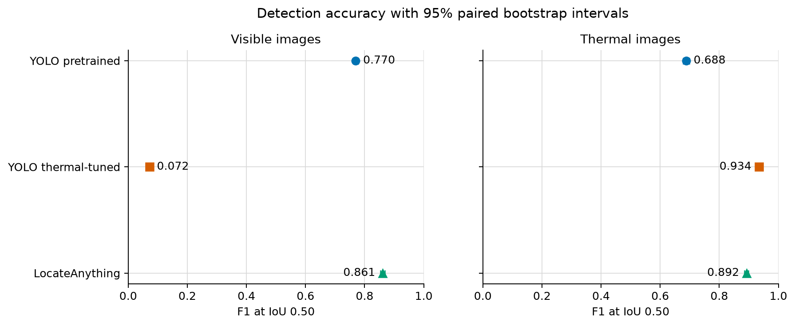
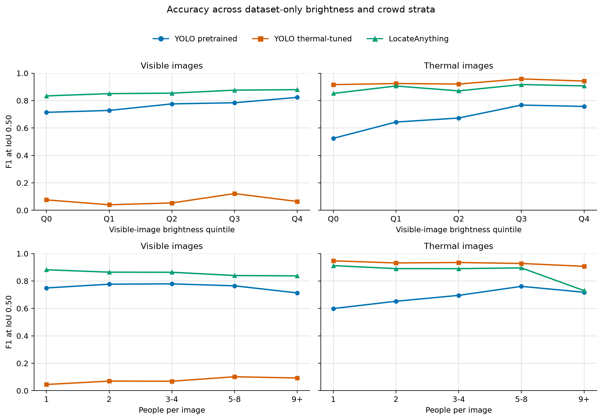
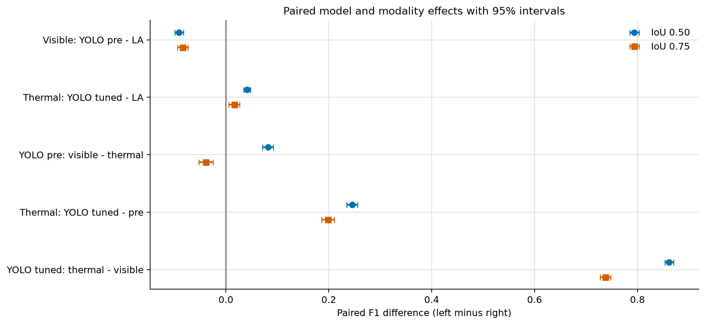
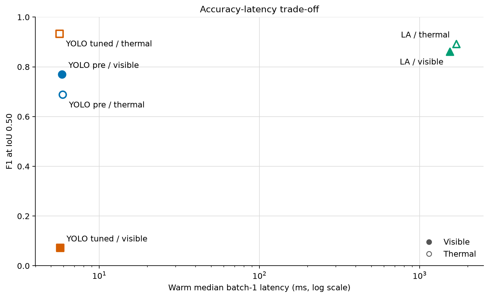

# Locked Full-Test Results

All six runs contain exactly 3,463 paired official test IDs. Intervals are 95% paired image-level percentile bootstrap intervals (2,000 replicates; seed 20260721).

## Primary confidence-independent metrics at IoU 0.50

| Run | P [95% CI] | R [95% CI] | F1 [95% CI] | Mean matched IoU | FP/image | FN/image |
| --- | ---: | ---: | ---: | ---: | ---: | ---: |
| yolo_pretrained_visible | 0.873 [0.864, 0.882] | 0.689 [0.677, 0.700] | 0.770 [0.761, 0.779] | 0.786 [0.782, 0.789] | 0.240 [0.222, 0.259] | 0.746 [0.715, 0.779] |
| yolo_pretrained_infrared | 0.885 [0.876, 0.893] | 0.563 [0.549, 0.577] | 0.688 [0.677, 0.699] | 0.837 [0.833, 0.840] | 0.176 [0.161, 0.191] | 1.047 [1.010, 1.083] |
| yolo_finetuned_visible | 0.166 [0.151, 0.183] | 0.046 [0.042, 0.051] | 0.072 [0.065, 0.080] | 0.648 [0.637, 0.658] | 0.556 [0.532, 0.580] | 2.287 [2.238, 2.339] |
| yolo_finetuned_infrared | 0.946 [0.941, 0.951] | 0.922 [0.916, 0.928] | 0.934 [0.929, 0.938] | 0.828 [0.826, 0.830] | 0.127 [0.115, 0.139] | 0.186 [0.171, 0.202] |
| locate_anything_visible | 0.903 [0.895, 0.910] | 0.823 [0.814, 0.832] | 0.861 [0.854, 0.868] | 0.795 [0.792, 0.798] | 0.213 [0.195, 0.230] | 0.424 [0.399, 0.449] |
| locate_anything_infrared | 0.931 [0.925, 0.938] | 0.856 [0.847, 0.865] | 0.892 [0.886, 0.899] | 0.848 [0.845, 0.851] | 0.151 [0.136, 0.166] | 0.344 [0.321, 0.369] |

### Output audit

| Run | Status counts | Duplicate-box rate | Malformed rate | No-output rate | Error rate |
| --- | --- | ---: | ---: | ---: | ---: |
| yolo_pretrained_visible | ok=3463 | 0.0133 | 0.0000 | 0.0000 | 0.0000 |
| yolo_pretrained_infrared | ok=3463 | 0.0108 | 0.0000 | 0.0000 | 0.0000 |
| yolo_finetuned_visible | ok=3463 | 0.0009 | 0.0000 | 0.0000 | 0.0000 |
| yolo_finetuned_infrared | ok=3463 | 0.0054 | 0.0000 | 0.0000 | 0.0000 |
| locate_anything_visible | malformed=8, no_output=32, ok=3423 | 0.0001 | 0.0023 | 0.0092 | 0.0000 |
| locate_anything_infrared | malformed=12, no_output=37, ok=3414 | 0.0000 | 0.0035 | 0.0107 | 0.0000 |

## Dataset-only strata at IoU 0.50

Brightness quintiles use visible-image intensity for both paired modalities (Q0 darkest, Q4 brightest). Values are F1 point estimates.

| Run | Q0 | Q1 | Q2 | Q3 | Q4 |
| --- | ---: | ---: | ---: | ---: | ---: |
| yolo_pretrained_visible | 0.714 | 0.728 | 0.776 | 0.784 | 0.823 |
| yolo_pretrained_infrared | 0.525 | 0.644 | 0.673 | 0.767 | 0.758 |
| yolo_finetuned_visible | 0.076 | 0.040 | 0.054 | 0.122 | 0.064 |
| yolo_finetuned_infrared | 0.916 | 0.925 | 0.921 | 0.958 | 0.942 |
| locate_anything_visible | 0.834 | 0.851 | 0.854 | 0.876 | 0.880 |
| locate_anything_infrared | 0.852 | 0.906 | 0.871 | 0.917 | 0.907 |

| Run | 1 person | 2 people | 3-4 | 5-8 | 9+ |
| --- | ---: | ---: | ---: | ---: | ---: |
| yolo_pretrained_visible | 0.749 | 0.777 | 0.779 | 0.765 | 0.713 |
| yolo_pretrained_infrared | 0.599 | 0.652 | 0.695 | 0.761 | 0.718 |
| yolo_finetuned_visible | 0.045 | 0.070 | 0.069 | 0.102 | 0.093 |
| yolo_finetuned_infrared | 0.947 | 0.932 | 0.935 | 0.928 | 0.907 |
| locate_anything_visible | 0.882 | 0.864 | 0.864 | 0.840 | 0.837 |
| locate_anything_infrared | 0.912 | 0.890 | 0.890 | 0.896 | 0.730 |

Object-size values are ground-truth recall using COCO native-pixel area thresholds. LLVIP's locked test labels contain no small boxes under this definition.

| Run | Medium recall | Large recall |
| --- | ---: | ---: |
| yolo_pretrained_visible | 0.366 | 0.706 |
| yolo_pretrained_infrared | 0.239 | 0.581 |
| yolo_finetuned_visible | 0.071 | 0.045 |
| yolo_finetuned_infrared | 0.735 | 0.932 |
| locate_anything_visible | 0.388 | 0.846 |
| locate_anything_infrared | 0.437 | 0.879 |

## Paired F1 differences (left minus right)

| Comparison | IoU 0.50 | IoU 0.75 |
| --- | ---: | ---: |
| visible_headline_yolo_pretrained_minus_locate_anything | -0.091 [-0.099, -0.083] | -0.084 [-0.094, -0.074] |
| thermal_headline_yolo_finetuned_minus_locate_anything | 0.042 [0.035, 0.048] | 0.016 [0.006, 0.027] |
| pretrained_modality_visible_minus_infrared | 0.082 [0.071, 0.092] | -0.039 [-0.052, -0.025] |
| thermal_supervision_finetuned_minus_pretrained | 0.246 [0.235, 0.256] | 0.198 [0.186, 0.211] |
| finetuned_modality_infrared_minus_visible | 0.862 [0.853, 0.870] | 0.738 [0.727, 0.748] |

## Secondary YOLO confidence-sweep metrics

| Run | AP50 | AP75 | mAP50-95 |
| --- | ---: | ---: | ---: |
| yolo_pretrained_visible | 0.768 | 0.398 | 0.411 |
| yolo_pretrained_infrared | 0.720 | 0.493 | 0.455 |
| yolo_finetuned_visible | 0.019 | 0.005 | 0.006 |
| yolo_finetuned_infrared | 0.944 | 0.707 | 0.620 |

## Warm batch-1 efficiency

| Run | Median ms | p95 ms | Images/s | Peak GiB | Cost/1,000 |
| --- | ---: | ---: | ---: | ---: | ---: |
| yolo_pretrained_visible | 5.9 | 6.6 | 168.437 | 0.06 | $0.003 |
| yolo_pretrained_infrared | 5.9 | 6.7 | 168.387 | 0.06 | $0.003 |
| yolo_finetuned_visible | 5.7 | 6.4 | 174.463 | 0.07 | $0.003 |
| yolo_finetuned_infrared | 5.6 | 6.6 | 174.981 | 0.07 | $0.003 |
| locate_anything_visible | 1541.5 | 1811.2 | 0.625 | 13.92 | $0.868 |
| locate_anything_infrared | 1691.1 | 1822.7 | 0.596 | 13.92 | $0.910 |

Efficiency uses per-record warm batch-1 latency and Modal's July 22, 2026 L40S GPU rate of $0.000542/second. It excludes cold start, host CPU/memory, storage, and optimized batch throughput.

YOLO AP metrics come from a separate confidence-0.001 sweep and are not inferred from the confidence-0.25 primary records.

Fixed disagreement selection and inspected overlays are documented in `reports/QUALITATIVE.md`.

Current pricing: https://modal.com/pricing
